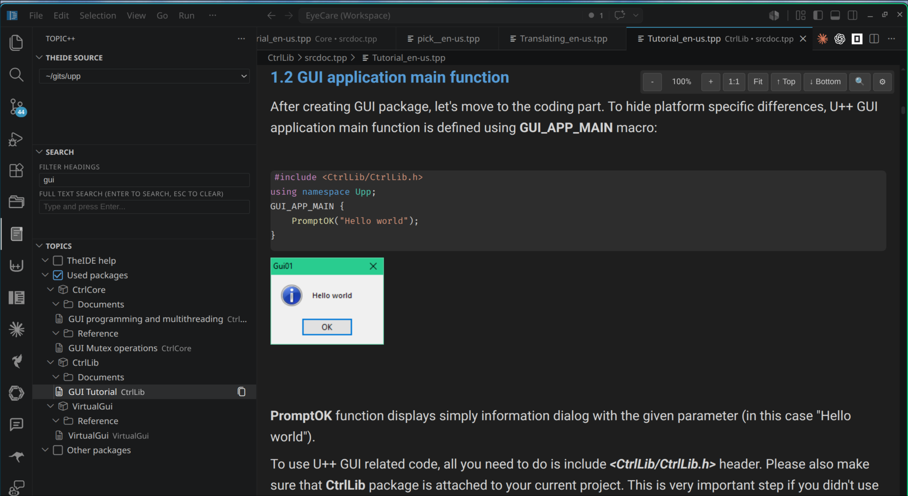

# U++ Topic++ Search & Preview for VS Code

<!-- Hero screenshot -->


**U++ Topic++ Preview** brings first-class search, browsing, and preview support for Ultimate++ Topic++ (`.tpp`) documentation in Visual Studio Code.

Browse and render Topic++ files with live HTML preview, syntax-highlighted code blocks, topic navigation, and full-text search — all without leaving VS Code.

[**Install from VS Code Marketplace**](https://marketplace.visualstudio.com/items?itemName=arilect.vscode-tpp-preview)

> **Note:** Designed for U++ Topic++ documentation and help systems.

---

## Features

- 📖 **Live preview** — updates as you edit `.tpp` files
- 🌳 **Topic tree browser** — organized by package and group
- 🔎 **Full-text & heading search** — quickly locate content across all topics
- 🔗 **Clickable `topic://` navigation** — jump between documents instantly
- 💻 **Syntax-highlighted code blocks** — powered by Shiki
- 📑 **Automatic table of contents** — per-topic navigation
- 🚀 **Publish mode** — clean HTML export without VS Code UI
- ⚙️ **Highly configurable rendering** — fonts, colors, code mode, and U++ source scanning

---

## Quick Start

1. Open a workspace containing `.tpp` files
2. Click a `.tpp` file to open the live preview
3. Use the **Topic++** activity bar to browse topics
4. Run **TPP: Open Preview** from the Command Palette for manual control

---

## Search System

The extension provides two complementary search modes:

### 🌳 Topic Tree Search
Filter topics by **package, group, or heading** directly in the sidebar tree view.

### 🔎 Full-Text Search
Search across the **entire content** of all Topic++ files.

### How they work together
Use the topic tree to narrow scope first, then apply full-text search inside that subset. This makes navigation fast even in large U++ codebases.

---

## What is Topic++?

Topic++ (`.tpp`) is the documentation system used by **Ultimate++**.

It is based on **QTF (Quixotic Text Format)** — a compact, bracket-based markup language designed for rich text, tables, and embedded code in C++ documentation.

QTF files are plain text, but can be difficult to read and edit manually. This extension provides a **readable preview layer** while keeping the original `.tpp` files untouched.

---

## QTF Example

```qtf
[s5; Introduction]

This is [*bold], [/italic], and [_underlined] text.

[l320; int main()
{
    Cout() << "Hello";
}]
````

**Rendered result:** formatted heading, styled text, and syntax-highlighted C++ code.

---

## Commands

| Command                          | Description                                  |
| -------------------------------- | -------------------------------------------- |
| `TPP: Open Preview`              | Open live preview for the active `.tpp` file |
| `TPP: Search Topic Headings`     | Search only topic headings                   |
| `TPP: Search Topics (Full Text)` | Search across full content                   |
| `TPP: Topic Table of Contents`   | Show outline for current topic               |
| `TPP: Refresh Topic Tree`        | Rebuild topic index                          |
| `TPP: Copy Topic Path`           | Copy selected topic path                     |

---

## Configuration

Customize rendering, fonts, and behavior via VS Code settings.

Common options:

* `tpp.fontFamily` — body font family
* `tpp.codeFontFamily` — code block font
* `tpp.tableBackgroundColor` — default table background color (tables with an explicit `@(R.G.B)` color in QTF source use that color instead)
* `tpp.publishMode` — clean HTML export mode
* `tpp.codeRenderingMode` — `vscode` (Shiki) or `u++`
* `tpp.uppsrcScanMode` — U++ source discovery mode

Full list available in `package.json`.

---

## Documentation

* 📘 [QTF Reference](QTF-summary.md)
* ⚙️ [Settings Reference](docs/settings.md)
* 🧭 [Command Reference](docs/commands.md)

---

## Development

```bash
git clone https://github.com/arilect/upp-tpp.git
cd upp-tpp
npm install
npm run compile
```

Watch mode:

```bash
npm run watch
```

Package extension:

```bash
npm install -g @vscode/vsce
vsce package
code --install-extension upp-tpp-*.vsix
```

---

## License

[MIT](LICENSE)

